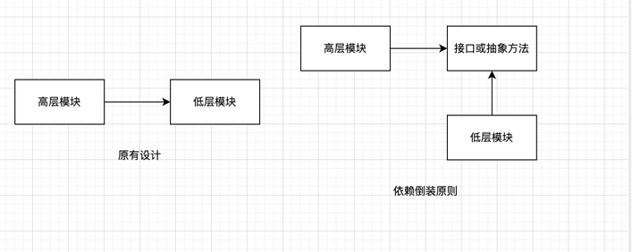

##### 1、依赖倒装原则

依赖倒装原则，指的是抽象不应该依赖细节，而细节应该依赖于抽象。

- 高层模块不应该依赖低层模块，两个都应该依赖抽象
- 抽象不应该依赖细节。细节应该依赖抽象

##### 2、里式代换原则

一个软件实体如果使用的是一个父类的话，那么一定适用于其子类，而且它觉察不出父类对象和子类对象的区别。也就是说，把父类都替换成它的子类，程序的行为没有变换。

子类型必须能够替换它们的父类型。

只有当子类可以替换掉父类，软件单位的功能不受影响时，父类才能真正被复用，而子类也能够在父类的基础上增加新的行为。

由于子类型的可替换性才使得使用父类类型的模块在无需修改的情况下就可以扩展。

原有设计中，高层模块直接依赖与低层模块，而当如果想复用高层模块时，因为与低层模块绑定在一起，很难复用
而依赖倒装，高层模块和低层模块都依赖于接口或抽象方法，扩展和可复用性更强。

面向对象设计的标志就是依赖倒装原则，应该考虑如何针对抽象编程而不是细节，即程序中的所有依赖关系都是终止于抽象类或者接口